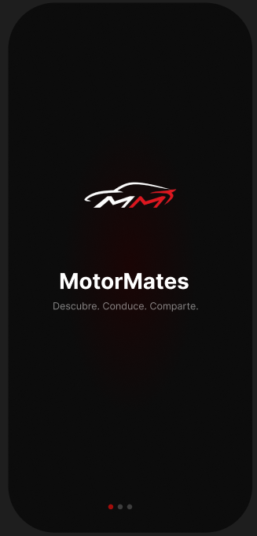
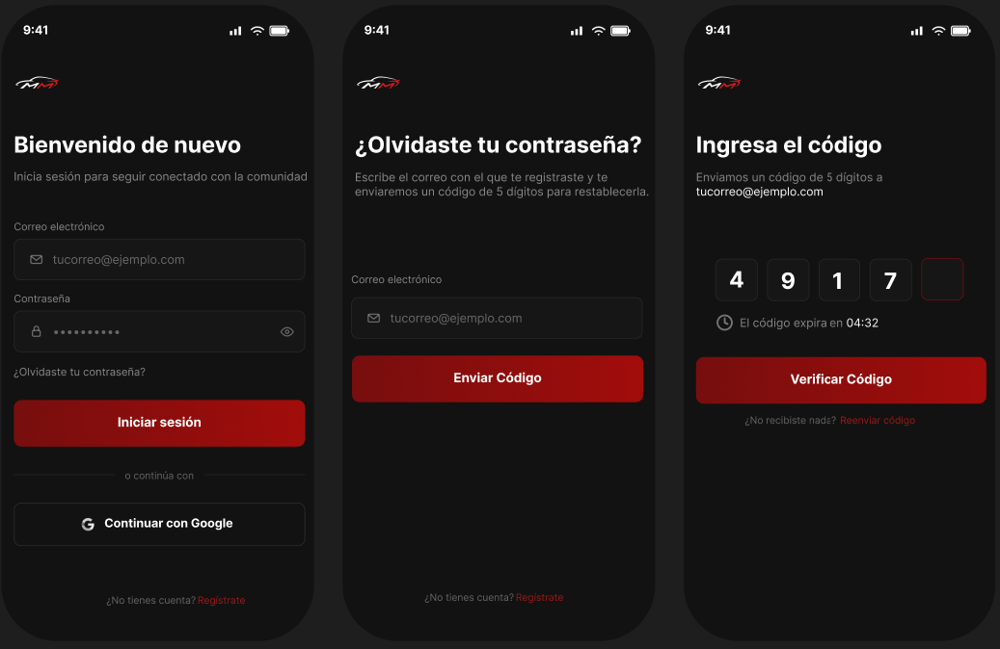
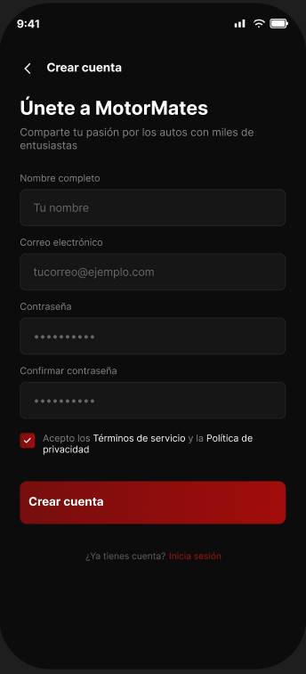

# MotorMates

MotorMates es una aplicación Android como proyecto para la clase de Computacion Movil de la Pontificia Universidad Javeriana, construida con Jetpack Compose, pensada como una red social para entusiastas de los autos: permite iniciar sesión/registrarse, ver un feed de reseñas de vehículos publicadas por otros usuarios y buscar/explorar autos por categoría.

Realizada por: 

Juan Jose Ballesteros Suarez

Juan Diego Rojas Osorio 

Diego Alejandro Melgarejo Bejarano

Jose Alejandro Villarroel Marcano

## Características

- **Autenticación**: pantallas de inicio de sesión y registro (`LoginScreen`, `RegisterScreen`).
- **Feed**: timeline de "stories" y reseñas de autos (`FeedScreen`) con acciones de like/comentario.
- **Búsqueda**: exploración de autos por categorías con resultados en grilla (`SearchScreen`).
- **Navegación** simple entre Login → Registro → Feed → Búsqueda, manejada en `MainActivity`.

## Tecnologías

- **Kotlin** 2.2.10
- **Jetpack Compose** (BOM 2026.02.01) con Material 3
- **Android Gradle Plugin** 9.3.1
- `minSdk` 26 · `targetSdk` / `compileSdk` 37

## Estructura del proyecto

```
app/src/main/java/com/example/motormates/
├── MainActivity.kt              # Punto de entrada y navegación entre pantallas
└── ui/
    ├── screens/
    │   ├── LoginScreen.kt
    │   ├── RegisterScreen.kt
    │   ├── FeedScreen.kt
    │   └── SearchScreen.kt
    └── theme/                    # Color, tipografía y tema de Compose
```

## Mockups

<p align="center">    </p>

## Requisitos

- Android Studio (versión compatible con AGP 9.3.1)
- JDK 11+
- Android SDK con la API 37 instalada

## Cómo ejecutar

1. Clona el repositorio.
2. Abre el proyecto en Android Studio.
3. Sincroniza Gradle (o desde consola: `./gradlew build`).
4. Ejecuta la app en un emulador o dispositivo físico con Android 8.0 (API 26) o superior.

```bash
# Compilar el proyecto
./gradlew build

# Instalar en un dispositivo/emulador conectado
./gradlew installDebug
```

## Tests

```bash
# Tests unitarios
./gradlew test

# Tests instrumentados (requiere dispositivo/emulador)
./gradlew connectedAndroidTest
```
